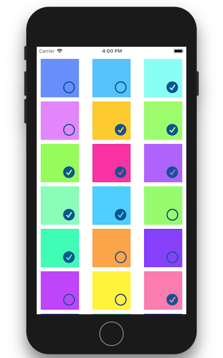

# CheckmarkCollectionViewCell


[![Swift Version][swift-image]][swift-url]
[![Build Status][travis-image]][travis-url]
[![License][license-image]][license-url]
[](https://img.shields.io/cocoapods/v/CheckmarkCollectionViewCell.svg)  
[](http://cocoapods.org/pods/CheckmarkCollectionViewCell)
[](http://makeapullrequest.com)

`UICollectionViewCell` with checkbox when it `isSelected` and empty circle when not - like Photos.app "Select" mode.


## Usage

```swift
class MyCell: CheckmarkCollectionViewCell {
    // get checkmark for free
}
```

### Changing Appearance

The properties below can be set in Interface Builder, in code, or through a UIAppearance proxy (e.g., `CheckmarkCollectionViewCell.appearance().deselectedImage = nil`).

Shape:

```swift
cell.selectedImage = UIImage(named: "x")
cell.deselectedImage = UIImage(named: "o")
```

Color:

```swift
cell.tintColor = .red
```

Size:

```swift
cell.checkmarkSize = 42.0
```

Layout:

```swift
cell.checkmarkMargin = 17.0
cell.checkmarkLocation = [NSLayoutConstraint.Attribute.top, NSLayoutConstraint.Attribute.left]
```

## Installation

### CocoaPods:

```ruby
pod 'CheckmarkCollectionViewCell'
```


### Swift Package Manager:

```swift
dependencies: [
    .package(url: "https://github.com/yonat/CheckmarkCollectionViewCell", from: "1.0.5")
]
```

## Meta

[@yonatsharon](https://twitter.com/yonatsharon)

[https://github.com/yonat/CheckmarkCollectionViewCell](https://github.com/yonat/CheckmarkCollectionViewCell)

[swift-image]:https://img.shields.io/badge/swift-4.2-orange.svg
[swift-url]: https://swift.org/
[license-image]: https://img.shields.io/badge/License-MIT-blue.svg
[license-url]: LICENSE.txt
[travis-image]: https://img.shields.io/travis/dbader/node-datadog-metrics/master.svg?style=flat-square
[travis-url]: https://travis-ci.org/dbader/node-datadog-metrics
[codebeat-image]: https://codebeat.co/badges/c19b47ea-2f9d-45df-8458-b2d952fe9dad
[codebeat-url]: https://codebeat.co/projects/github-com-vsouza-awesomeios-com
